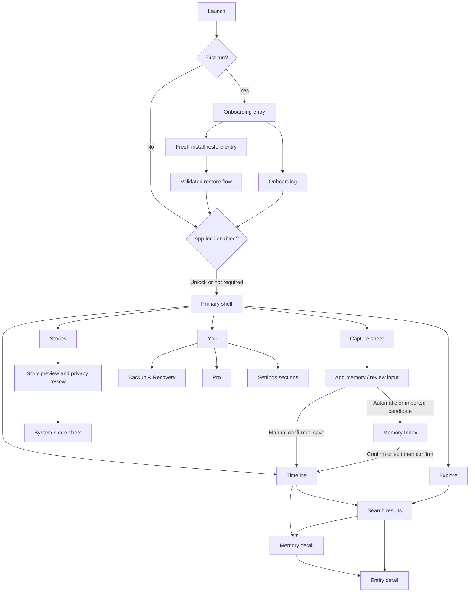

# UI Reference Specification

**Status:** **IMPLEMENTATION-READY** — directional visual reference with authoritative corrections; not authorization to begin implementation  
**Project name:** **Life Timeline** is the working project name only  
**Reference image:** `docs/design/reference/mvp-ui-overview.png`

## Purpose and authority

This document translates the reference image into reusable design guidance. The image is a visual concept board, not a pixel-perfect target and not a source of product, privacy, architecture, monetization, or domain rules.

The authority order is:

1. Product design documentation (PDD) and accepted ADRs
2. `AGENTS.md`
3. Repository-local `life-timeline-ui` and `life-timeline-architecture` guidance
4. This reference specification
5. The generated reference image

Where the image differs from `08-ui-design-system.md`, `09-motion-icons-illustration.md`, the roadmap, or an accepted ADR, the documented value or decision wins. This specification adds no product features. It does not authorize Flutter scaffolding or implementation.

“Aevyra,” its logo, tagline, sample people, dates, memories, prices, imagery, and all other example content in the image are placeholders. They must not be treated as the final identity or copied into production content.

### Readiness review

Reviewed against `08-ui-design-system.md`, `09-motion-icons-illustration.md`, `AGENTS.md`, and the repository-local `life-timeline-ui` guidance on 2026-08-09. No blocking conflicts remain in this specification. Each conflict visible in the generated image is resolved by the authority rules and correction matrix below.

`IMPLEMENTATION-READY` means this document may guide a separately authorized implementation. It does not approve unresolved product choices, move later-phase features into MVP, authorize Flutter changes, or turn conceptual image details into design-system rules. Work affected by a human-approval item must use an approved default or wait for that decision.

## 1. Overall visual direction

### Quiet Intelligence

The reference broadly supports **Quiet Intelligence**: a calm, modern, private, temporal interface in which intelligence is present but not theatrical. The product should feel capable through information hierarchy, evidence, relationships, and carefully timed feedback—not through neon AI styling, constant animation, or chatbot conventions.

The visual character should be:

- Personal, with the user's own memories providing most of the richness.
- Quiet, with neutral backgrounds, restrained surfaces, and limited simultaneous emphasis.
- Intelligent, with contextual insight surfaces and evidence-backed actions.
- Temporal, with dates, periods, nodes, connectors, and continuity visible in the layout.
- Private, with clear but non-alarmist protection and sharing cues.
- Timeless, avoiding trend-heavy effects that will age quickly.
- Accessible, including Dynamic Type/text scaling, screen-reader semantics, high contrast, large targets, keyboard/focus support where applicable, and Reduced Motion.

### Visual hierarchy

Each screen should have one dominant purpose and a small number of subordinate actions. Recommended hierarchy:

1. Screen identity or current temporal context
2. Primary content or decision
3. Supporting metadata and evidence
4. Contextual actions
5. Tertiary status or guidance

Dates, temporal precision, titles, and confirmation state must be easier to find than decorative metadata. Intelligence should appear beside the record or task it explains, not as a competing global layer. A persistent generic chatbot should not become the primary interface.

### Whitespace

Whitespace separates temporal groups and decisions rather than merely making cards look premium. Use larger gaps between years, months, sections, and task groups; use smaller tokenized gaps within a record. Keep page gutters stable across sibling screens and allow content density to increase gradually on larger layouts.

Do not compress layouts to preserve the reference image's apparent phone proportions. At large text sizes, sections may grow vertically, controls may wrap, and horizontal groups may become vertical.

### Surface treatment

The base is a warm/neutral background with white or neutral secondary surfaces in light mode. Prefer hierarchy from spacing, typography, dividers, and tonal surfaces before adding elevation. Cards are appropriate for bounded objects such as a Story, evidence preview, backup status, or insight; they should not turn the timeline, Explore, or search into undifferentiated card feeds.

Use:

- Flat or softly bordered surfaces for routine content
- Slight elevation for transient overlays and actionable floating surfaces
- `primarySoft` for selection or restrained intelligence emphasis
- Gradients only for intelligence/memory emphasis and expressive Stories

Avoid excessive shadows, nested cards, decorative glass, glow, or ornamental gradients.

### Imagery

User photography and evidence thumbnails should provide the main visual richness. Images should retain useful focal content through semantic crops and must have meaningful descriptions when they convey information.

Editorial illustration is appropriate for onboarding and empty states when real user content does not yet exist. It should use thin geometric forms, timeline paths/nodes, objects, and soft atmospheric treatment—not generic SaaS characters or mascots.

No private memory should be exposed on a locked surface before authentication. A lock screen may use neutral bundled artwork, a user-approved privacy-safe image, or a sufficiently obscured treatment after a security decision.

### Primary and accent colors

The official light and dark color tokens in `08-ui-design-system.md` are authoritative. Indigo/violet is the primary interaction and intelligence accent, not a blanket decoration color. Success, warning, and danger colors are reserved for their semantic meanings. Category or timeline-node differentiation must remain secondary, accessible, and tokenized; the image's assorted node colors are not an approved palette.

Privacy classification must never be communicated by color alone. Use text, iconography, and semantics together.

## 2. Screen inventory visible in the reference

The names below identify the concepts shown in the image. They do not guarantee that every depicted capability belongs in MVP.

| Screen | Product role | Direction to retain | Corrections and phase constraints |
|---|---|---|---|
| Splash / Unlock | Entry and local app-lock gate | Calm identity, a single primary unlock action, biometric plus PIN fallback | Final name/identity is undecided. Do not expose private user imagery or details before unlock. Lock policy comes from security requirements, not the image. |
| Onboarding | Explain the value and privacy posture, then lead to first value | Short value narrative, local-first/private-by-design language, one clear call to action | No account should be required. The “old photo/receipt/document” wow moment is a product goal, but OCR/automatic extraction is Phase 2 unless separately brought forward. Avoid absolute privacy claims that ignore user-owned off-device backups. |
| Timeline Home | Primary interface for confirmed personal history | Year/month grouping, temporal line, meaningful nodes, occasional hero memories, search/filter access | Must remain a timeline rather than a generic feed. Show imprecise dates honestly. The official primary navigation includes Stories, not Inbox. Long timelines must be lazy/virtualized. |
| Capture Sheet | Primary action chooser | A focused bottom sheet with scannable capture paths and a non-dominating Capture affordance | Show only capture modes approved for the current phase. Camera/gallery/document may support attachments; voice capture and AI extraction are not authorized solely by the image. AI-derived results must become candidates. |
| Add Memory | Manual creation or review of proposed fields | Clear form hierarchy, evidence attachment, notes, explicit save/confirm action | Must support temporal precision beyond “exact date,” provenance where relevant, relationships/entities, validation, and accessible error states. Automatic/imported proposals go through confirmation and the Memory Inbox. |
| Memory Inbox | Human review of candidate memories | Candidate count/state, evidence preview, review actions, clear progress without urgency | Applies to automatically discovered or imported candidates. Required actions are Confirm, Edit then confirm, Link to existing entity, Ignore, and Delete candidate. Candidate/confirmed/done semantics must be defined outside presentation. |
| Memory Detail | Read and act on a confirmed historical record | Strong title/date hierarchy, evidence gallery, linked metadata, edit/share actions | “Memory” is a presentation concept; the underlying model remains Entity/Event/Evidence/Relationship. Sharing must use the privacy sanitizer and local Story/export path, never raw records. Approximate dates and provenance need representation. |
| Entity Detail | Show a persistent thing/place/organization and its history | Identity summary plus related chronological events | Do not duplicate event data into an entity-shaped record. Relationships and evidence should link back to authoritative domain objects. The image's device-specific content is sample data only. |
| Explore | Browse structured history by category, highlights, and available insights | A discoverable overview with restrained visual groupings | Avoid a generic dashboard of decorative cards. Phase-gate insights, achievements, and other generated summaries. Categories shown in the image are examples, not a final taxonomy. |
| Search Results | Retrieve records locally and show why they match | Persistent search query, grouped result types, filters, thumbnails where useful | Basic SQLite FTS is MVP. Semantic search and natural-language “Ask My Life” are later phases. Filters/counts in the image are conceptual. Results should expose record type, date precision, and evidence without leaking sensitive snippets. |
| Stories | List private, locally generated share artifacts/templates | More expressive imagery than core UI and an obvious route to preview | This is not a social feed. No likes, followers, comments, or public profiles. Basic Stories are MVP; advanced templates, Then & Now, and Life Wrapped are later phases. |
| Story Preview | Review a sanitized local render before sharing | Immersive preview, limited chrome, clear final review | Must show what will be shared, provide accessible non-gesture controls, enforce privacy classification, and use the system share sheet. “Swipe up” cannot be the only action. |
| Backup & Recovery | Protect data and support fresh-install restore | Understandable status, manual backup action, restore/import entry points | MVP is manual encrypted backup and restore to a user-selected destination. Archive is separate. Future automatic backup, provider integrations, backup health, and Recovery Kit must be phase-gated. Never imply local-only storage is itself a backup. |
| Settings / You | Local preferences, protection, data management, and app information | Grouped settings rows, local-only identity if useful, routes to security/backup/data controls | Do not imply an account or company-hosted profile. Data handling, security, and backup settings should be more prominent than cosmetic options. “You” remains the official primary destination label unless changed by product approval. |
| Pro | Explain optional permanent entitlement after value is demonstrated | Restrained value summary, one-time purchase direction, restore purchase route | Free retains unlimited basic entries and access to user-created timeline data. Never imply that Pro unlocks ownership of memories. Price, SKU, allowance, included features, currency, and “priority future features” copy are not approved constants. |

## 3. Reusable UI components

Names are conceptual; final Dart names should follow the app's conventions. Components own presentation and interaction patterns, not privacy, entitlement, persistence, or domain decisions.

| Component | Reusable responsibility | Expected variants/notes |
|---|---|---|
| `AppButton` | Consistent labeled actions | Primary, secondary, tertiary/text, destructive, loading, disabled; responsive label wrapping; icons only through `AppIcons` |
| `AppIconButton` | Compact universal actions | Normal and compact icon tokens; semantic label and large accessible target |
| `SurfaceCard` | Bounded content surface without repeated styling | Flat/bordered, selected, actionable, elevated-overlay; use sparingly |
| `TimelineNode` | Render a temporal item and its state | Confirmed/candidate/milestone emphasis and selected state; icon plus label, never color alone; domain mapping supplied by caller |
| `TimelineConnector` | Communicate continuity between nodes/groups | Handles first/last/group breaks and Reduced Motion; decorative line excluded from accessibility tree |
| `TimelineSectionHeader` | Identify year/month/range and support navigation | Sticky behavior only where tested with text scaling and screen readers |
| `FilterChip` / `CategoryChip` / `StatusChip` | Selection and filtering | Shared chip foundation with distinct semantics; counts optional; horizontally scrolling rows need an accessible alternative |
| `SectionHeader` | Title, optional supporting text, optional trailing action | Consistent hierarchy across Explore, Stories, settings, and detail screens |
| `ImageCard` | Reusable image-led memory/evidence presentation | Hero, thumbnail, landscape, square; overlays must meet contrast and avoid obscuring evidence |
| `MemoryCard` | Present one memory/event summary | Compact row, visual card, hero; composes image, temporal metadata, privacy/status, and actions |
| `PrimaryNavigation` | App shell navigation | Exactly the documented destinations: Timeline, Explore, Capture, Stories, You; Capture invokes the sheet and must not overpower other destinations |
| `AppBottomSheet` | Accessible modal container | Capture chooser, filters, contextual actions; safe-area aware, focus managed, draggable behavior not required for access |
| `CaptureActionTile` | One supported capture path | Icon, title, short explanation, availability state; capabilities determined outside UI |
| `MemoryRow` | Candidate/search/related-memory list item | Thumbnail optional; clear type, temporal precision, state, and accessible action pattern |
| `EvidenceThumbnail` / `EvidenceStrip` | Preview supporting images/documents | Loading/error/unavailable/archived states; no large original decode for a small thumbnail |
| `PrivacyBadge` | Display a domain-provided privacy classification | `share_safe`, `personal`, `sensitive`, `never_share`; icon + text + semantics; must not decide or default classification |
| `EmptyState` | Explain an empty collection and offer the next valid action | Timeline, Inbox, search, Stories, and evidence variants; editorial illustration optional |
| `AppSearchField` | Local search entry | Clear control, query persistence, loading/result semantics, keyboard actions, sensitive-query handling |
| `SettingsRow` | Navigate or change a setting consistently | Navigation, toggle, value, destructive; label and current value remain readable at large text sizes |
| `IntelligenceCard` / `InsightSurface` | Contextual evidence-backed suggestion or insight | Uses restrained intelligence symbol and `primarySoft`; one-time reveal only; always links to supporting records where it states an answer |
| `MemoryInboxCard` | Candidate review summary | Evidence, confidence/provenance summary where appropriate, possible match, and explicit review entry point |
| `StoryCard` | Story/template/result summary | Image-led, selected-field summary, local-generation or draft state; expressive treatment allowed within Story boundaries |
| `StoryPrivacyReview` | Review fields before local render/share | Selected fields, sensitive-field warnings, explicit inclusion controls; domain sanitizer remains authoritative |
| `BackupHealthCard` | Present protection status | Must distinguish backup from local storage and archive; MVP may use a simpler status than future backup health |
| `StorageHealthCard` | Present storage composition and actions | Future phase; do not implement from the image alone |
| `TimeScrubber` | Navigate a long timeline efficiently | Future/validated interaction; accessible alternative and restrained haptics required |
| `AppScaffold` / `ResponsiveContentFrame` | Shared safe areas, gutters, width constraints, app bars, and navigation placement | Supports compact, medium, and expanded layouts without encoding one phone size |

Composition is preferred to broad inheritance. For example, `MemoryCard` may compose `ImageCard`, temporal metadata, and `PrivacyBadge`; it should not be copied into separate Timeline, Explore, and Search versions with divergent styling.

## 4. Design tokens inferred from the reference

### Authority rule

The reference suggests semantic uses for tokens but cannot change official values. Feature widgets must not introduce arbitrary values where a token exists. Any semantic aliases proposed below require design-system approval before implementation.

### Color

Use the exact official tokens from `08-ui-design-system.md`.

| Role | Light | Dark |
|---|---:|---:|
| `background` | `#F8F8FA` | `#0D0D10` |
| `surface` | `#FFFFFF` | `#16161B` |
| `surfaceSecondary` | `#F2F2F6` | `#1E1E24` |
| `textPrimary` | `#18181B` | `#F5F5F7` |
| `textSecondary` | `#71717A` | `#A1A1AA` |
| `textTertiary` | `#A1A1AA` | `#71717A` |
| `border` | `#E4E4E7` | `#29292F` |
| `divider` | `#ECECEF` | Use a theme-derived divider consistent with the dark palette; value requires design-system approval |
| `primary` | `#5451D6` | `#8B87FF` |
| `primarySoft` | `#EEEEFF` | `#24223D` |
| `success` | `#2E8B68` | Dark semantic value requires design-system approval |
| `warning` | `#C88725` | Dark semantic value requires design-system approval |
| `danger` | `#D14D4D` | Dark semantic value requires design-system approval |

The dark semantic and divider gaps above already exist in the official document; this reference does not invent replacements.

### Spacing

Official primitive scale: `4, 8, 12, 16, 20, 24, 32, 40, 48, 64`.

The reference suggests these semantic roles, all mapped to official primitives:

- Inline icon/text gap: compact end of the scale
- Within-row and within-control gap: small-to-regular tokens
- Card/content inset: regular tokens
- Compact page gutter: regular token; comfortable/expanded gutters may step upward
- Section gap: larger token than item gap
- Major temporal group gap: section/major spacing token
- Modal bottom safe-area spacing: system inset plus a spacing token

Final alias names and mappings should be approved centrally. Layout must prefer reflow over shrinking when text scales.

### Radius

Use the official values without reinterpretation:

| Role | Radius |
|---|---:|
| Small control | `8` |
| Button | `12` |
| Card | `16` |
| Large card | `20` |
| Bottom sheet | `28` |
| Pill | Full |

Image clipping should use the radius of its owning surface. Avoid introducing per-screen radii copied from the mockup.

### Typography hierarchy

Use the official centralized scale:

| Style | Size/line height | Weight |
|---|---:|---|
| Display | `40/48` | SemiBold |
| Hero | `32/40` | SemiBold |
| Title 1 | `28/34` | SemiBold |
| Title 2 | `22/28` | SemiBold |
| Title 3 | `18/24` | SemiBold |
| Body Large | `17/26` | Regular |
| Body | `15/22` | Regular |
| Body Small | `13/18` | Regular |
| Label | `13/18` | Medium |
| Caption | `11/16` | Medium |

The reference's very small secondary text must not drive implementation. Never rely on Caption for essential actions or critical privacy/status information. Support platform typography and Dynamic Type/text scaling without truncating meaning.

### Icons

Use Hugeicons Free only through `AppIcons`, subject to license verification before release.

- Normal: `24px`
- Compact visual size: `20px`
- Feature/signature: `28–32px`
- Rounded stroke and consistent visual weight

Visual icon size is separate from the accessible touch target. Custom icons are limited to Life Intelligence, Life Graph, Memory, Story, Timeline Milestone, and Private AI.

### Elevation and shadows

The image suggests three semantic elevation roles:

1. **Flat:** background, timeline content, settings rows; divider or tonal separation only
2. **Raised:** actionable card or floating navigation/capture affordance; subtle shadow if required
3. **Overlay:** bottom sheet/dialog; strongest elevation in the core UI, still restrained

Exact shadow offsets, blur, spread, and opacity are not defined by the PDD and must not be sampled from the image. Approve central light/dark shadow tokens before implementation. In dark mode, borders and tonal separation should do more work than shadows.

### Image aspect ratios

The reference supports a small role-based set rather than per-screen pixel sizes:

- `1:1` for compact thumbnails and evidence tiles
- `4:3` for memory/evidence cards when the source benefits from more height
- `16:9` for Story and wide hero cards
- Full-bleed viewport treatment only for approved Story preview or privacy-safe lock artwork

Use crop/focal-point behavior, intrinsic sizing where evidence must remain legible, generated thumbnails, and responsive constraints. Exact ratios may vary for original evidence; never crop away information required to understand a document.

### Motion tokens

The official durations are `80ms`, `140ms`, `220ms`, `320ms`, `450ms`, and `600–900ms` for Story-only motion. The different timing values printed in the reference image are not authoritative.

## 5. Navigation and layout relationships

### Primary shell

The documented primary destinations are:

```text
Timeline | Explore | Capture | Stories | You
```

Capture is an action in the primary shell that opens a sheet; it should not read as a sixth destination or visually dominate the interface. Memory Inbox is important but is not currently an approved replacement for Stories in primary navigation. Its final entry point requires product approval; plausible contextual entries include a badged Timeline action, a Timeline section, or a route from You.

### Screen relationship map



Fresh-install restore must be reachable before a user creates a new local timeline; its exact onboarding placement and copy require product/security design. Search may be entered from Timeline or Explore. Memory Inbox needs an approved contextual route in addition to the candidate flow shown above, but must not silently replace Stories in primary navigation.

### Layout behavior

- **Compact:** single-column screens, bottom primary navigation, full-width sheets within safe areas.
- **Medium:** constrained content width, additional whitespace, and optional two-column groups where reading order remains clear.
- **Expanded/tablet:** navigation rail or equivalent adaptive shell; Timeline may pair chronology with a selected detail pane; Explore/Search may pair results with detail. Do not merely stretch phone cards.
- **Landscape:** protect minimum readable widths and safe areas; Story preview may use a centered canvas rather than edge-to-edge cropping.
- **Large text:** reflow metadata and actions vertically, replace crowded action rows with menus where appropriate, and preserve all primary actions.

Numeric breakpoints and maximum widths are not established by the PDD and require design-system approval.

## 6. Motion opportunities

All motion must explain change, continuity, intelligence, or accomplishment. Most UI remains at levels 0–2. Reduced Motion substitutes are mandatory.

| Opportunity | Level | Direction | Reduced Motion |
|---|---:|---|---|
| Unlock success | 1–2 | Brief content transition using official quick/standard timing; no fake biometric delay | Immediate state change or short crossfade |
| Onboarding page change | 2 | Standard slide/fade with stable CTA placement | Crossfade or instant page change |
| Timeline viewport reveal | 2 | Official signature: subtle fade plus about 8px translation for visible items only | Fade only or static |
| Time scrubber settling | 1–2 | Smooth settling and restrained haptic feedback | Immediate position update; haptic optional |
| Memory to detail | 2 | Shared-element/Hero transition when image continuity adds meaning | Crossfade or direct navigation |
| Add confirmed memory | 2–3 | Node appears once and connector resolves to show continuity | Insert statically with a brief highlight |
| Capture/filter bottom sheet | 2 | Use the official `320ms` emphasis token if a full structural transition is warranted | Short fade or immediate open/close |
| Chip/button feedback | 1 | `80ms`/`140ms` state response; haptic only where useful and platform-appropriate | Color/outline/state change only |
| Candidate confirmation | 2–3 | One-time move/resolution that explains Inbox → Timeline | Status text and immediate list update |
| Intelligence reveal | 3 | One-time `450ms` restrained reveal, then static | Static surface with explicit “new” semantics if needed |
| Backup/restore | 1–3 | Real progress stages and completion state; never a fake spinner or fake delay | Determinate status text/progress without transforms |
| Story creation/preview | 3–4 | Meaningful recomposition using `600–900ms` only inside Story creation/preview | Static preview change or brief crossfade |

No permanent pulsing, decorative looping, routine confetti, or glow should be introduced. Animate only visible timeline items and avoid large image decoding on the UI thread.

## 7. Accessibility considerations

- Preserve a logical reading order independent of visual connector placement. A screen reader should hear time period, event title, temporal precision, type/state, and available actions in a predictable sequence.
- Exclude decorative timeline lines and ornamental icons from semantics; provide labels for meaningful icons through `AppIcons` consumers.
- Do not communicate category, candidate state, privacy classification, confidence, backup health, or validation by color alone.
- Meet applicable contrast requirements in both themes, including text over photography, disabled controls, tertiary text, chips, dividers, focus indicators, and Story overlays.
- Support Dynamic Type/text scaling. Avoid fixed-height text containers, essential single-line truncation, and action rows that cannot wrap.
- Use platform-appropriate minimum touch targets even when the visible icon is `20px` or `24px`.
- Give headings, lists, groups, controls, progress, errors, and selected states appropriate semantics. Announce asynchronous search, candidate confirmation, backup progress, and restore results without excessive interruption.
- Provide keyboard and switch-access focus order where applicable. Modal sheets/dialogs must manage focus and restore it on close.
- Every gesture-only behavior needs a control alternative. Story Preview cannot depend only on swiping; the time scrubber needs accessible increment/decrement or direct period selection.
- Images that carry meaning need concise descriptions. Decorative/editorial images should be excluded from accessibility output.
- Forms must associate labels, hints, errors, required state, and temporal-precision controls. Dates and number/currency formats must be localized.
- Biometric unlock requires an accessible PIN fallback and clear error/retry behavior.
- Respect OS Reduced Motion and avoid vestibular effects. Haptics must be restrained and not the sole feedback channel.
- Protect privacy in accessibility labels, app-switcher previews, notifications, screenshots where platform controls permit, and pre-unlock surfaces.
- Empty, loading, offline/local-only, unavailable attachment, archived attachment, error, and recovery states require accessible copy and next actions.

## 8. Dark-mode adaptations

Dark mode is a first-class theme, not an inverted afterthought.

- Use the official dark tokens from `08-ui-design-system.md`; do not sample dark colors from the Pro mockup.
- Use `background`, `surface`, and `surfaceSecondary` to preserve depth. Prefer tonal contrast and borders over stronger shadows.
- Use dark `primary` and `primarySoft` for selection and intelligence emphasis. Avoid luminous violet glows or broad saturated panels in routine UI.
- Re-evaluate semantic success/warning/danger and privacy colors for contrast; final dark values need central approval.
- Apply theme-aware scrims to text over photos. Do not dim evidence so heavily that documents or memories become unreadable.
- Keep thumbnails close to source appearance while adapting surrounding chrome, placeholders, loading states, and image controls.
- Make timeline connectors and dividers visible without letting them dominate. Selected nodes need a non-color indicator.
- Story canvases may preserve an intentionally light or custom template, while surrounding app chrome follows dark mode and clearly frames the export boundary.
- System status/navigation bars, keyboard appearance, sheets, menus, dialogs, focus indicators, and app-switcher privacy treatment must match the active theme.
- Verify OLED-black assumptions against the official `#0D0D10`; do not replace it with arbitrary pure black per screen.

## 9. Conceptual elements that must not become hardcoded rules

The following are inspiration or sample content only:

- “Aevyra,” its star/crown marks, tagline, typography lockup, and any implied final brand personality
- All sample names, dates, places, devices, employers, photos, documents, amounts, counts, categories, and account/person details
- The exact number of onboarding pages or screens in the board
- The image's category colors, node-type legend, icon choices, and color swatches where they differ from official tokens
- The exact timeline density, event frequency, thumbnail frequency, and date ranges
- The scenic unlock/onboarding imagery and its composition
- Capture modes, “Beta” labels, and AI promises not present in the current roadmap phase
- Search filter names, result-group counts, highlight types, achievements, and insight copy
- Story titles, templates, layouts, and preview gestures beyond features approved in the PDD
- Backup timestamps, destinations, “up to date” wording, automatic-health implications, and recovery labels
- Pro price/currency, complimentary allowance, feature list, future-feature priority, permanent marketing copy, and purchase timing
- “Share-safe (default)” or any other privacy default inferred from the legend
- Exact shadows, opacity, gradient stops, illustration assets, crop positions, animation curves, and motion values printed in the image
- Phone-specific widths, heights, safe-area positions, and navigation geometry

These may become requirements only after the appropriate product, security, privacy, design-system, or architecture approval.

## 10. Inconsistencies and weaknesses to correct

| Conflict in the generated reference | Source that wins | Why that source wins | Required correction |
|---|---|---|---|
| Placeholder brand appears throughout | `AGENTS.md` | It explicitly says Life Timeline is a working title and no final brand is approved; generated artwork cannot establish product identity | Use working-project language or neutral placeholders until identity approval |
| Inbox replaces Stories in bottom navigation | `08-ui-design-system.md` | It defines the authoritative five primary destinations | Keep Timeline, Explore, Capture, Stories, You; decide a contextual Inbox entry point |
| Pro advertises “unlimited memories & attachments” | `AGENTS.md` plus accepted ADR-0008 | They prohibit gating access to user-created timeline data and require a genuinely useful Free tier | Free keeps unlimited basic entries and access to user-created data; sell convenience/intelligence, not access |
| Mock price and “priority future features” | `AGENTS.md` plus the PDD/accepted ADR-0008 | The official business direction is one-time Pro, but exact commercial values and future promises are not approved by a generated image | Use localized store/configuration data and approved purchase copy; do not hardcode price or priority promises |
| “Share-safe (default)” appears in the legend | `AGENTS.md` plus the privacy PDD | Privacy classifications are enforced domain rules; the image has no authority to choose a universal default | Classification/default policy must come from domain/privacy design; sensitive Story fields default off |
| “All data stays on your device” is absolute | `AGENTS.md` | It defines local-first behavior together with encrypted user-owned backups, which may intentionally leave the device | Use precise wording: no company-hosted timeline, with encrypted backups the user controls |
| Image-specific color values differ from official tokens | `08-ui-design-system.md` | It is the centralized source of truth for light/dark color tokens | Ignore image swatches and use official theme tokens only |
| Image-specific motion timings differ from official tokens | `09-motion-icons-illustration.md` | It defines the duration scale and permitted motion levels | Use `80ms`, `140ms`, `220ms`, `320ms`, `450ms`, and Story-only `600–900ms` |
| Image icon examples could encourage direct or mixed icon usage | `09-motion-icons-illustration.md` and `AGENTS.md` | Both require one rounded-stroke Hugeicons Free family through `AppIcons`, with a tightly limited custom set | Map universal concepts through `AppIcons`; verify the Hugeicons Free license and do not mix libraries |
| Exact-date UI dominates Add Memory/detail | `AGENTS.md` | Temporal precision is a non-negotiable domain requirement and exact dates must never be invented | Support exact, month, year, approximate, range, before, after, and unknown |
| Capture/AI copy blurs manual and candidate lifecycles | `AGENTS.md` | It requires AI/import discoveries to enter Memory Inbox and receive human confirmation | Make manual confirmed save and automatic/import candidate review paths explicit |
| Several insights, achievements, and advanced filters appear MVP-ready | `AGENTS.md` and the roadmap | Work must stay inside the current roadmap phase; the image cannot add scope | Label concepts by phase and expose only implemented capabilities |
| Explore/Search rely heavily on repeated cards | `08-ui-design-system.md` and `life-timeline-ui` | Both require a timeline-first signature and reject generic card feeds | Use sections, lists, temporal groupings, and cards only for bounded/high-value content |
| Lock screen uses rich full-bleed imagery without a privacy rule | `AGENTS.md` | Privacy and app-lock protection outrank visual richness | Use neutral or explicitly privacy-safe artwork until pre-unlock policy is approved |
| Small text, chips, and icon actions are visually dense | `08-ui-design-system.md`, `09-motion-icons-illustration.md`, and `life-timeline-ui` | Accessibility, Dynamic Type, semantic labels, large targets, and Reduced Motion are mandatory | Reflow at large text sizes, enlarge targets, strengthen semantics/contrast, and test responsive states |
| Story Preview emphasizes a swipe gesture | `08-ui-design-system.md` and `AGENTS.md` | Accessibility and privacy-safe explicit sharing are requirements; a gesture cannot be the only path | Provide explicit preview, privacy review, share, and back controls |
| Backup screen compresses backup, import, and recovery concepts | `AGENTS.md` | It requires encrypted user-owned backup, fresh-install recovery, and a strict distinction between Backup and Archive | Separate backup, restore, and archive language; expose real validation/progress and fresh-install recovery |
| “Memory” details do not clearly expose Entity/Event/Evidence relationships | `AGENTS.md` | The structured domain model is non-negotiable and cannot be flattened by presentation | Keep friendly presentation while preserving linked domain objects, provenance, and evidence |
| Category-colored timeline nodes appear to define domain types | `08-ui-design-system.md` and `AGENTS.md` | Color must remain tokenized and restrained, and accessibility/domain semantics cannot come from an unapproved legend | Approve a semantic mapping; pair icon/label/shape/state with restrained tokenized color |
| Loading, error, unavailable evidence, and destructive states are mostly absent | `life-timeline-ui` | Its screen checklist explicitly requires empty/error/loading states, accessibility semantics, privacy review, and low visual noise | Specify and test empty/loading/error/offline/unavailable/archived/undo/recovery states per component |
| Settings gives visual parity to cosmetic and data-safety rows | `AGENTS.md` | Protecting data, privacy, backup, and recovery are higher-order product requirements | Give security, backup/recovery, privacy, export, and data management clear hierarchy |

## Implementation guardrails for the next phase

When implementation is authorized later:

- Build from centralized design tokens and semantic aliases, not measurements sampled from the image.
- Use Hugeicons Free through `AppIcons`; verify the license before release and do not mix icon families.
- Use responsive composition, lazy timelines, thumbnails, and content-aware image loading.
- Keep widgets presentation-focused. Domain/application layers own privacy, entitlement, candidate lifecycle, provenance, temporal precision, and backup rules.
- Reuse the components above before creating screen-specific duplicates.
- Define empty, loading, error, unavailable, archived, and destructive/undo states alongside each screen.
- Test light/dark themes, Dynamic Type/text scaling, screen readers, keyboard/focus behavior, high contrast, and Reduced Motion.
- Keep features within the current roadmap phase and do not infer scope from the image.

## Decisions requiring human approval

1. Final product name, logo, tagline, and identity system.
2. Final Memory Inbox entry point while preserving the documented five primary destinations.
3. Semantic spacing aliases, responsive breakpoints, maximum content widths, and expanded/two-pane layouts.
4. Central elevation/shadow tokens and missing dark semantic/divider color values.
5. Approved timeline node/state taxonomy and whether category colors are needed at all.
6. Pre-unlock imagery/privacy policy and detailed app-lock behavior.
7. Which capture modes ship in MVP and whether any OCR-assisted onboarding work moves earlier than Phase 2.
8. Final onboarding sequence, privacy wording, and first-value flow.
9. Privacy-classification defaults and which badges are routinely visible versus shown contextually.
10. Initial Story template set, export aspect ratios, privacy-review interaction, and expressive visual range.
11. Pro SKU, localized pricing, complimentary intelligence allowance, entitlement copy, purchase timing, and final feature allocation.
12. Custom signature icon designs and Hugeicons Free license verification outcome.
13. Whether a `TimeScrubber`, entity/detail split view, or other reference-only interaction belongs in the first prototype.
